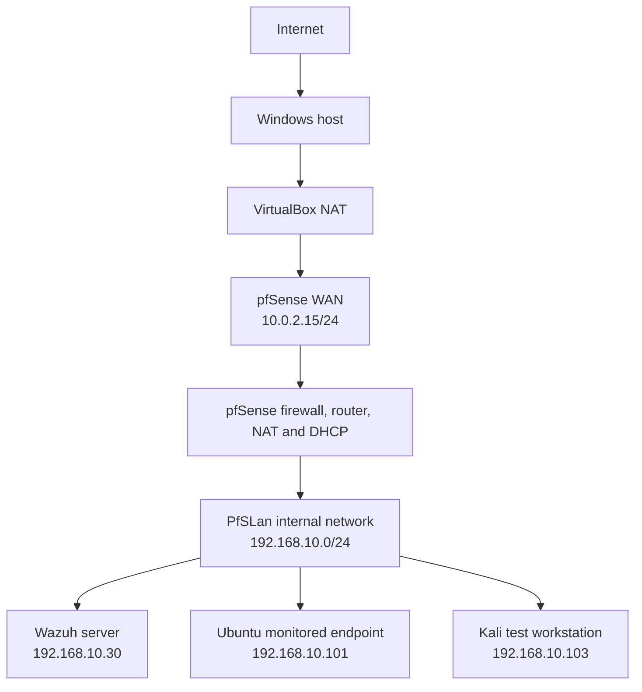

# Home Cyber Lab

A documented, isolated cybersecurity lab built in VirtualBox to practise network segmentation, firewall administration, endpoint monitoring, security-event correlation, and defensive testing.

> All testing in this repository was performed on systems I own and control inside a private virtual network. The material is for defensive education and authorised lab use only.

## Project goals

- Build a segmented virtual network protected by pfSense.
- Centralise endpoint security events with Wazuh.
- Generate controlled security events from Kali Linux.
- Investigate alerts using evidence from services, logs, firewall rules, and packet captures.
- Document repeatable troubleshooting and safe restoration steps.

## Network architecture



See [Network architecture](docs/network-architecture.md) for the IP plan, trust boundaries, and traffic flow.

## Core components

| Component | Purpose | Lab address |
| --- | --- | --- |
| Windows host | Runs VirtualBox and provides upstream connectivity | Host-managed |
| pfSense 2.8.1 | Firewall, router, NAT and DHCP boundary | LAN `192.168.10.1` |
| Wazuh 4.14.7 | Manager, indexer, Filebeat pipeline and dashboard | `192.168.10.30` |
| Ubuntu 25 | Monitored endpoint with Wazuh agent | `192.168.10.101` |
| Kali Linux | Authorised security-testing workstation | `192.168.10.103` |

## Detection exercises completed

### SSH authentication failure

A controlled SSH attempt from Kali used a nonexistent Ubuntu username. Wazuh decoded the event and generated:

- Rule `5710`
- Level `5`
- Description: `sshd: Attempt to login using a non-existent user`
- MITRE ATT&CK: `T1110.001` Password Guessing and `T1021.004` SSH

### Correlated SSH brute-force pattern

Multiple controlled failures were generated from the same Kali address. Wazuh correlated the underlying events and generated:

- Rule `5712`
- Level `10`
- Frequency threshold: `8` matching events within `120` seconds
- Description: `sshd: brute force trying to get access to the system. Non existent user.`
- MITRE ATT&CK: `T1110` Brute Force

Fail2Ban initially blocked the source after five failures. Its runtime threshold was temporarily raised in the isolated lab so Wazuh's eight-event correlation rule could be observed, then immediately restored to `5`.

### File Integrity Monitoring preparation

The Ubuntu agent's scheduled FIM configuration was verified. It monitors `/etc`, `/usr/bin`, `/usr/sbin`, `/bin`, `/sbin`, and `/boot`, with a scan frequency of `43,200` seconds. Real-time monitoring of a dedicated test directory is planned as the next exercise.

## Investigation highlights

- Diagnosed a Wazuh server disk at 100% utilisation.
- Isolated approximately 19 GB of regenerable vulnerability-feed cache data.
- Restored Wazuh manager, indexer, Filebeat, and dashboard services.
- Distinguished a listening service from a reachable service using `ss`, `nc`, firewall counters, and `tcpdump`.
- Identified a mistyped interface name in an `iptables` rule.
- Discovered Fail2Ban's `f2b-sshd` chain taking precedence over a later allow rule.
- Validated the complete path from Ubuntu logs to a Wazuh dashboard alert.

## Repository layout

```text
home-cyber-lab/
├── README.md
├── SECURITY.md
├── LICENSE
├── .gitignore
├── GITHUB_SETUP.md
└── docs/
    ├── commands.md
    ├── network-architecture.md
    └── lab-notes/
        └── 2026-08-24-wazuh-ssh-detection.md
```

## Safe operating order

Start the lab in this order:

1. pfSense
2. Wazuh server
3. Ubuntu monitored endpoint
4. Kali test workstation

Shut it down in reverse order, with pfSense last.

## Documentation

- [Network architecture](docs/network-architecture.md)
- [Command reference](docs/commands.md)
- [Wazuh SSH detection lab notes](docs/lab-notes/2026-08-24-wazuh-ssh-detection.md)
- [GitHub publishing steps](GITHUB_SETUP.md)

## Roadmap

- Configure real-time FIM for a dedicated test directory.
- Detect file creation, modification, and deletion.
- Add sanitised screenshots with sensitive values redacted.
- Add Windows endpoint monitoring.
- Build a small incident-response playbook for SSH alerts.
- Export selected Wazuh events for repeatable analysis.

## Author

Christy Francis — BSc Cyber Security student building practical defensive-security skills through an isolated home lab.

