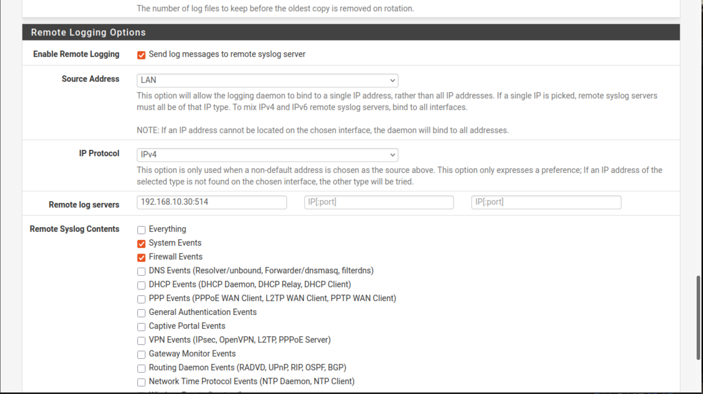
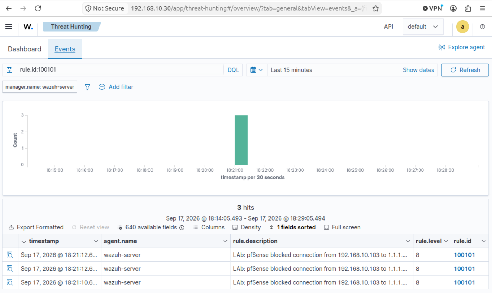
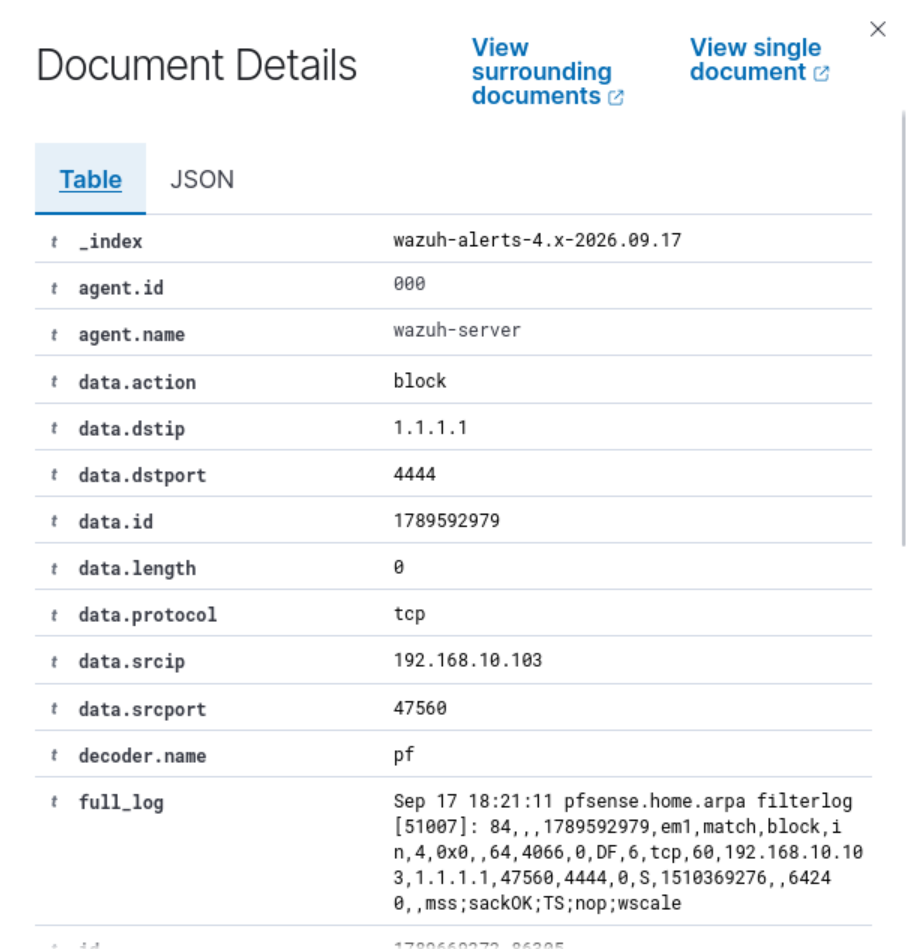
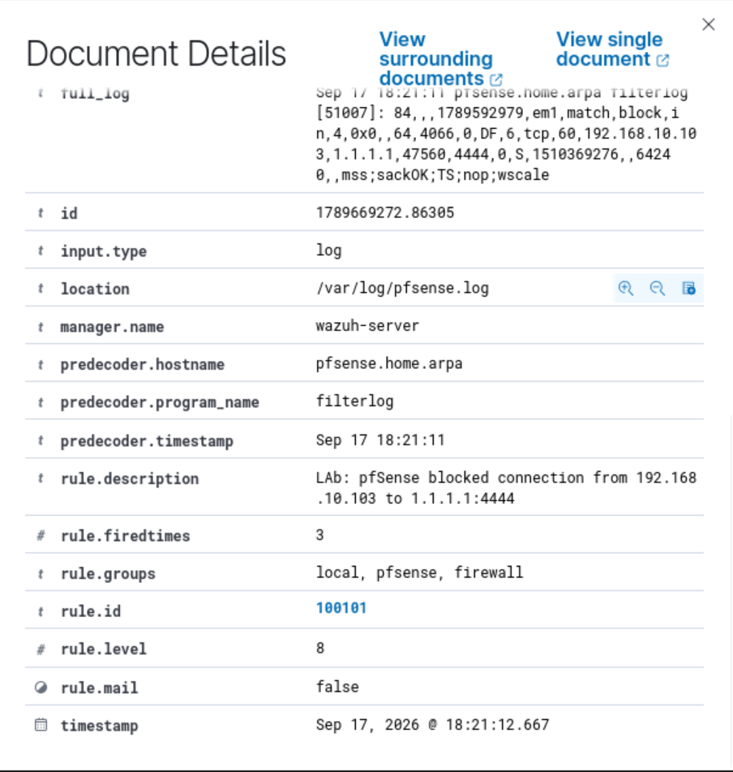
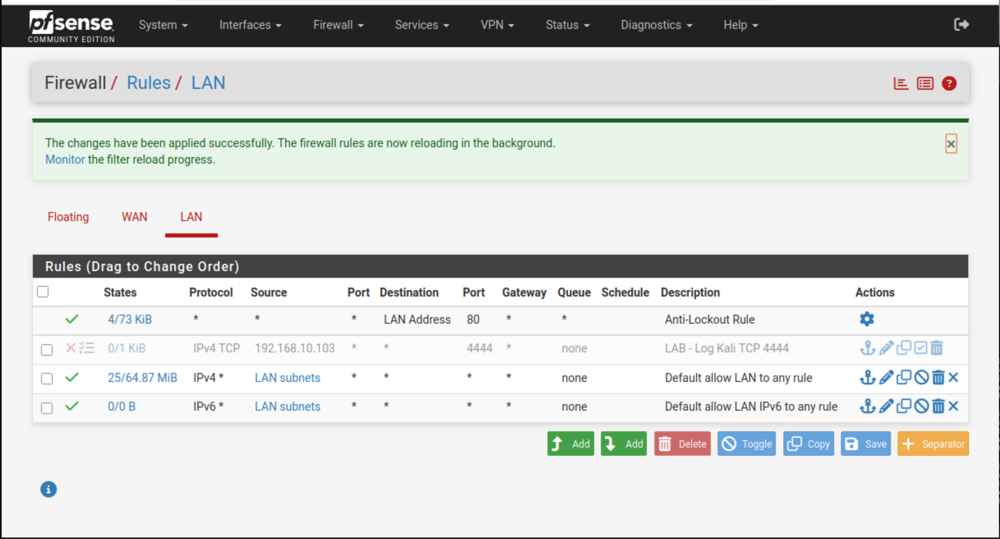

# Week 2 – pfSense Firewall Log Integration with Wazuh

**Date:** 17 September 2026  
**Status:** Completed  
**Environment:** Isolated VirtualBox home cyber lab

## Objective

Integrate pfSense firewall logs with Wazuh, generate a controlled blocked connection from Kali Linux, and confirm that Wazuh decodes the event and creates a searchable security alert.

## Lab systems

| System | Role | Lab address |
| --- | --- | --- |
| pfSense | Firewall, router and remote syslog source | `192.168.10.1` |
| Wazuh server | Syslog receiver, log analysis and dashboard | `192.168.10.30` |
| Kali Linux | Controlled traffic source | `192.168.10.103` |

All activity was performed in an authorised, isolated lab environment.

## Data flow

1. Kali generated a TCP connection attempt to `1.1.1.1:4444`.
2. A temporary pfSense LAN rule blocked and logged the traffic.
3. pfSense forwarded the event to the Wazuh server over UDP port `514`.
4. `rsyslog` stored the event in `/var/log/pfsense.log`.
5. Wazuh Logcollector read the file and the `pf` decoder extracted the firewall fields.
6. Custom rule `100101` created a level-8 alert that appeared in Threat Hunting.

## 1. Configure the Wazuh server as a syslog receiver

The following rsyslog configuration was created as `/etc/rsyslog.d/10-pfsense.conf`:

```conf
module(load="imudp")
input(type="imudp" port="514")

if ($fromhost-ip == "192.168.10.1") then {
    action(type="omfile" file="/var/log/pfsense.log")
    stop
}
```

The configuration was validated and the service restarted:

```bash
sudo rsyslogd -N1
sudo systemctl restart rsyslog
sudo systemctl is-active rsyslog
sudo ss -lunp | grep ':514'
```

The service reported `active`, and rsyslog was listening on UDP port `514`.

## 2. Enable remote logging in pfSense

In **Status → System Logs → Settings**, remote logging was configured with:

- Remote logging enabled
- Source address: LAN
- IP protocol: IPv4
- Remote server: `192.168.10.30:514`
- Log categories: System Events and Firewall Events



Incoming messages were confirmed on the Wazuh server:

```bash
sudo tail -f /var/log/pfsense.log
```

## 3. Configure Wazuh Logcollector

The following block was added to `/var/ossec/etc/ossec.conf`:

```xml
<localfile>
  <log_format>syslog</log_format>
  <location>/var/log/pfsense.log</location>
</localfile>
```

After restarting Wazuh, `/var/ossec/logs/ossec.log` confirmed that Logcollector was analysing `/var/log/pfsense.log`.

```bash
sudo systemctl restart wazuh-manager
sudo systemctl is-active wazuh-manager
sudo grep -i 'pfsense.log' /var/ossec/logs/ossec.log | tail -n 5
```

## 4. Create the custom Wazuh alert rule

Wazuh's built-in pfSense rule `87701` correctly decoded individual blocked connections but included the `no_log` option. A local child rule was therefore created to generate an alert for each block event.

File: `/var/ossec/etc/rules/pfsense_local_rules.xml`

```xml
<group name="local,pfsense,firewall,">
  <rule id="100101" level="8">
    <if_sid>87701</if_sid>
    <description>LAB: pfSense blocked connection from $(srcip) to $(dstip):$(dstport)</description>
  </rule>
</group>
```

The ruleset was validated before restarting the manager:

```bash
sudo /var/ossec/bin/wazuh-analysisd -t && echo "RULES VALID"
sudo systemctl restart wazuh-manager
sudo systemctl is-active wazuh-manager
```

Validation returned `RULES VALID`, and the manager returned to the `active` state.

## 5. Generate a controlled firewall event

A temporary pfSense LAN rule was placed above the default allow rule:

| Setting | Value |
| --- | --- |
| Action | Block |
| Address family | IPv4 |
| Protocol | TCP |
| Source | `192.168.10.103/32` |
| Destination | Any |
| Destination port | `4444` |
| Logging | Enabled |
| Description | `LAB - Log Kali TCP 4444` |

From Kali, the following controlled test was run:

```bash
nc -vz -w 3 1.1.1.1 4444
```

The connection timed out as expected because pfSense silently blocked it. Netcat caused multiple TCP SYN attempts, producing three related firewall events.

## 6. Confirm the alert in Wazuh

The alert was first confirmed from the command line:

```bash
sudo grep '"id":"100101"' /var/ossec/logs/alerts/alerts.json | tail -n 3
```

In **Threat Intelligence → Threat Hunting**, the following DQL query was used with the time range set to **Last 15 minutes**:

```text
rule.id:100101
```

The dashboard displayed three level-8 alerts.



The expanded event showed the network fields extracted by the pfSense decoder:

- `data.action`: `block`
- `data.protocol`: `tcp`
- `data.srcip`: `192.168.10.103`
- `data.dstip`: `1.1.1.1`
- `data.dstport`: `4444`
- `decoder.name`: `pf`



The rule information confirmed:

- `rule.id`: `100101`
- `rule.level`: `8`
- `rule.groups`: `local, pfsense, firewall`
- Log source: `/var/log/pfsense.log`



## Troubleshooting and lessons learned

### Direct Wazuh syslog listener conflict

Adding a direct syslog `<remote>` block to `ossec.conf` caused configuration errors in this environment. The configuration was restored from backup, and rsyslog was used as the UDP receiver instead. Wazuh then monitored the resulting log file with `<localfile>`.

### No alert from built-in rule `87701`

`wazuh-logtest` showed that pfSense events decoded successfully and matched rule `87701`, but the rule contains `<options>no_log</options>`. A local child rule was required to create visible individual alerts.

### Duplicate custom rule ID

Rule ID `100100` was already present in `local_rules.xml`. The pfSense rule was changed to the unused ID `100101`, then validated with `wazuh-analysisd -t` before restarting the manager.

### Collection verification

The Wazuh Logcollector state file showed increasing event and byte counters with zero drops. This confirmed that events were being collected even before a visible alert rule was added.

## Cleanup

After collecting the evidence, the temporary `LAB - Log Kali TCP 4444` rule was disabled and the firewall configuration was applied. Remote pfSense logging and custom Wazuh detection remain enabled for future testing.



## Result

The integration was successful. pfSense firewall events travelled from the firewall to rsyslog, were written to `/var/log/pfsense.log`, decoded by Wazuh, matched by custom rule `100101`, and displayed as level-8 alerts in the Wazuh dashboard.

## Skills demonstrated

- pfSense firewall rule configuration and remote logging
- UDP syslog collection with rsyslog
- Wazuh Logcollector configuration
- XML custom-rule creation and validation
- Firewall log analysis and decoder testing
- SIEM alert investigation using Wazuh Threat Hunting
- Safe testing, evidence collection and post-test cleanup

## Security note

Only screenshots suitable for a public portfolio are included. Screenshots containing passwords or login credentials must never be committed to a public repository.
