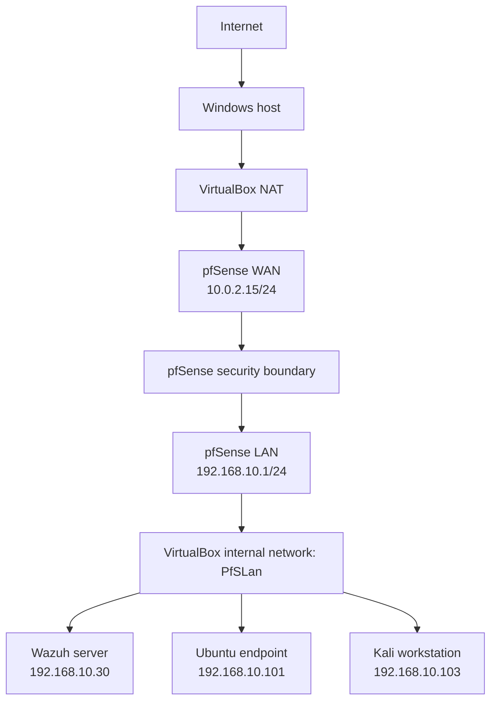

# Network architecture

## Topology

## IP plan

| System | Interface/role | Address | Notes |
| --- | --- | --- | --- |
| pfSense | WAN | `10.0.2.15/24` | Receives upstream access through VirtualBox NAT |
| pfSense | LAN | `192.168.10.1/24` | Default gateway for the private lab |
| Wazuh server | LAN | `192.168.10.30/24` | Manager, indexer, Filebeat, and dashboard |
| Ubuntu endpoint | LAN | `192.168.10.101/24` | Wazuh agent ID `001` |
| Kali workstation | LAN | `192.168.10.103/24` | Authorised test source |

All addresses are private RFC 1918 lab addresses. They are not publicly routable.

## Trust boundaries

### Upstream boundary

VirtualBox NAT separates the lab from the physical network. The pfSense WAN interface uses the NAT-provided `10.0.2.0/24` network.

### Internal lab boundary

`PfSLan` is a VirtualBox internal network using `192.168.10.0/24`. Lab systems communicate on this segment, with pfSense providing routing and policy enforcement for traffic leaving the segment.

### Monitoring path

## Design rationale

- pfSense provides a clear network-security boundary.
- Kali is isolated from unrelated physical-network devices.
- Wazuh centralises detection while the Ubuntu endpoint retains its own local protections.
- Fail2Ban supplies rapid local response, while Wazuh supplies centralised analysis and correlation.
- Private, predictable addressing makes evidence and troubleshooting repeatable.

